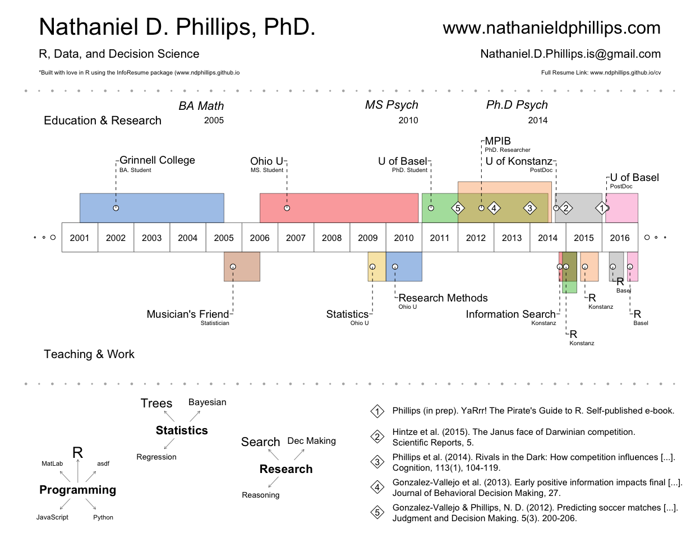

<!-- README.md is generated from README.Rmd. Please edit that file -->
VisualResume
============

The `VisualResume` package contains the `VisualResume.R` function which produces a Visual resume like the one below:

``` r
VisualResume::VisualResume(
  titles.left = c("Nathaniel D. Phillips, PhD.", "R, Data, and Decision Science", "*Built with love in R using the InfoResume package (www.ndphillips.github.io"),
  titles.right = c("www.nathanieldphillips.com", "Nathaniel.D.Phillips.is@gmail.com", "Full Resume Link: www.ndphillips.github.io/cv"),
  center.labels = c("Education & Research", "Teaching & Work"),
  top = data.frame(title = c("Grinnell College", "Ohio U", "U of Basel", "MPIB", "U of Konstanz", "U of Basel"),
                   sub = c("BA. Student", "MS. Student", "PhD. Student", "PhD. Researcher", "PostDoc", "PostDoc"),
                   start = c(2001.5, 2006.5, 2011, 2012, 2014.7, 2016.1),
                   end = c(2005.5, 2010.9, 2014.5, 2014.6, 2016, 2017)),
  bottom = data.frame(title = c("Musician's Friend", "Statistics", "Research Methods", "Information Search", "R", "R", "R", "R"),
                      sub = c("Statistician", "Ohio U", "Ohio U", "Konstanz", "Konstanz", "Konstanz", "Basel", "Basel"),
                      start = c(2005.5, 2009.5, 2010, 2014.8, 2014.8, 2015.4, 2016.1, 2016.7),
                      end = c(2006.5, 2010, 2011, 2015.3, 2015.3, 2015.9, 2016.6, 2017)),
  milestones = data.frame(title = c("BA Math", "MS Psych", "Ph.D Psych"),
                          subtitle = c("2005", "2010", "2014"),
                          date = c(2005.5, 2010.9, 2014.5)),
  events = data.frame(year = c(2016, 2015, 2014, 2013, 2012),
                      title = c("Phillips (in prep). YaRrr! The Pirate's Guide to R. Self-published e-book.",
                                "Hintze et al. (2015). The Janus face of Darwinian competition.\nScientific Reports, 5.",
                                "Phillips et al. (2014). Rivals in the Dark: How competition influences [...].\nCognition, 113(1), 104-119.",
                                "Gonzalez-Vallejo et al. (2013). Early positive information impacts final [...].\nJournal of Behavioral Decision Making, 27.",
                                "Gonzalez-Vallejo & Phillips, N. D. (2012). Predicting soccer matches [...].\nJudgment and Decision Making. 5(3). 200-206.")),
  interests = list("Programming" = c(rep("R", 20), rep("Python", 1), rep("JavaScript", 2), "MatLab", "asdf"),
                   "Statistics" = c(rep("Trees", 10), rep("Bayesian", 5), rep("Regression", 3)),
                   "Research" = c(rep("Search", 10), rep("Dec Making", 5), rep("Reasoning", 3)))
)
```



You can install `VisualResume` from GitHub as follows:

``` r
#install.packages("devtools") # Only if you don't have the devtools package
devtools::install_github("ndphillips/VisualResume")
```
